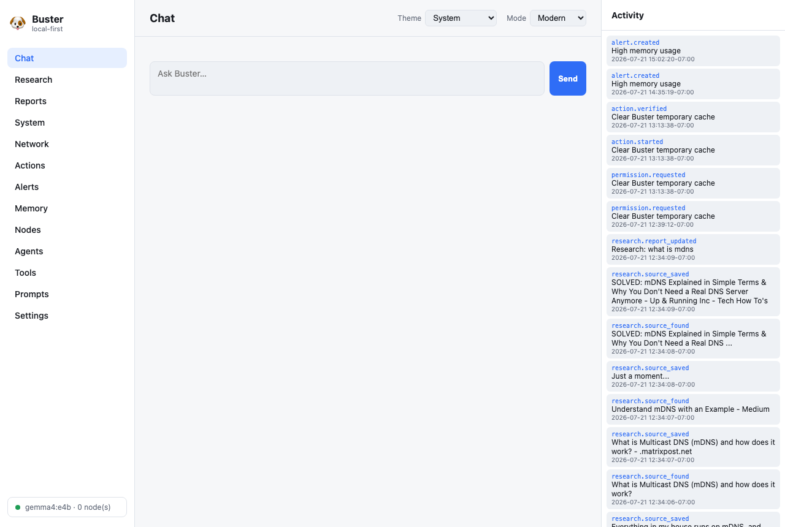
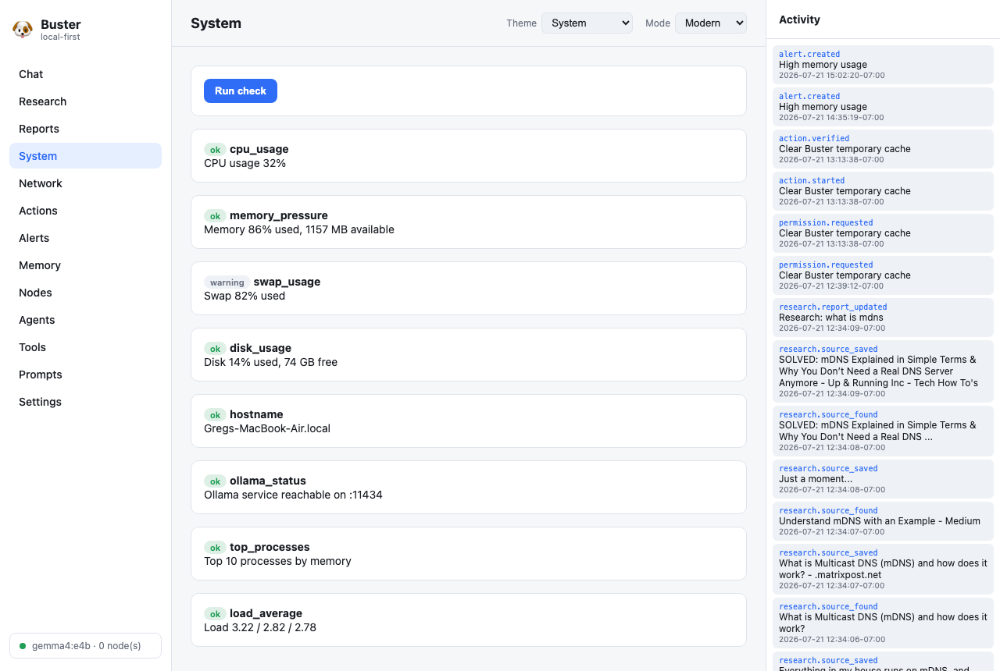
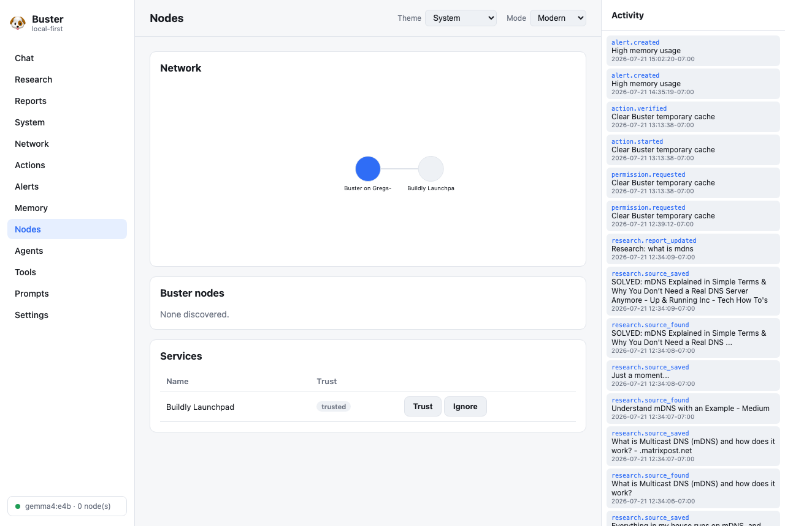
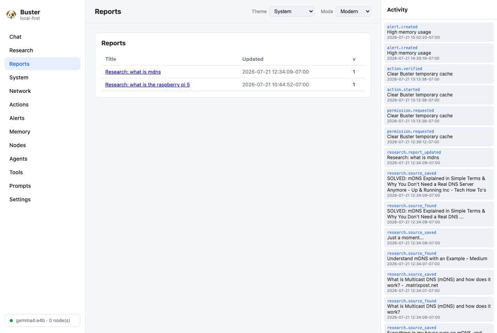
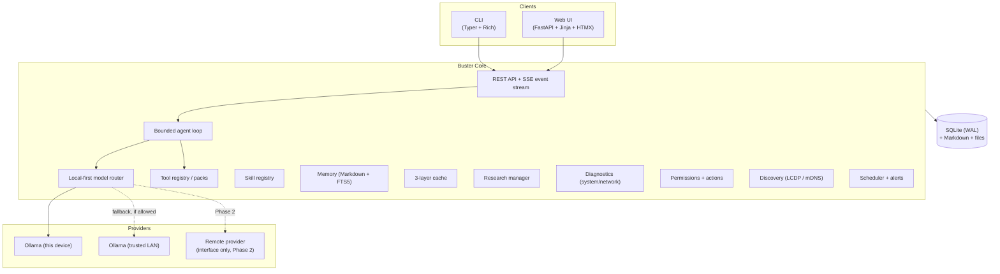
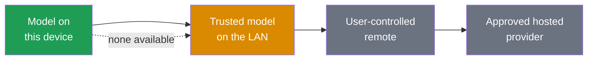
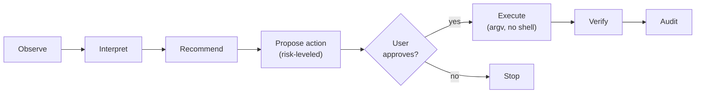

<div align="center">

# 🐶 Buster

**A lightweight, hardware-adaptive, local-first assistant for research, reporting,
machine diagnostics, network monitoring, and safe action — from [Buildly](https://buildly.io).**

[](docs/ROADMAP.md)
[](pyproject.toml)
[](tests/)
[](#license)
[](#inference-local-first)

</div>

Buster runs on macOS and Linux — from Raspberry Pi-class devices up to GPU
workstations — and adapts to the hardware and services around it. It prefers
models running on the current device, discovers the capabilities in its
environment, and only reaches out to the local network or remote services when
necessary **and permitted**. It stays useful even with no language model loaded:
monitoring, discovery, alerts, diagnostics, caching, and scheduling all run
deterministically.

---

## Screenshots

| Chat — local-first, shows inference location | System diagnostics |
|---|---|
|  |  |

| Nodes & network graph (deterministic) | Reports |
|---|---|
|  |  |

> Every assistant reply shows the model, where inference happened (`device` /
> `lan` / `remote`), and whether data left the machine — visible in the chat
> footer and the live activity stream on the right.

---

## Quick start

```sh
# One-line install (macOS / Linux)
curl -fsSL https://install.buster.buildly.io | sh

# …or from a checkout
git clone https://github.com/buildlyio/buster
cd buster
./install.sh
```

After install:

```
Buster is running.

CLI:       buster
Web:       http://buster.local:8765
Fallback:  http://localhost:8765
Status:    buster status

Inference policy: Local first
```

If `buster.local` isn't available on your network, the `localhost` URL always
works. See [Hostnames & local DNS](#hostnames--local-dns-pi-hole-etc) if you use
a `.home` suffix (Pi-hole/router DNS).

---

## Principles

1. **Local first** — prefer on-device models; ask before sending content outside
   the local network.
2. **Hardware adaptive** — detect the machine and adapt. Raspberry Pi is the
   *minimum* tier, implemented as an adapter — not the design center.
3. **Lightweight at rest** — Python + SQLite + Markdown + filesystem. No mandatory
   Docker, Kubernetes, Redis, Postgres, or Node.js on the target machine.
4. **User control** — Buster distinguishes observation, interpretation,
   recommendation, proposed action, approved action, and verified result. It
   never silently changes your system or sends data remotely.

---

## Architecture

Buster is **one assistant** (Buster Core) exposed through two first-class clients
— a CLI and a local web app — that share the same API, event stream,
conversations, tasks, and reports.



### Inference: local first

The model router tries, in order:



Remote inference is **never** chosen just because it's faster. It's only
considered when there's no suitable local model, the machine lacks resources, the
local model lacks a capability, context exceeds local capacity, the user requests
it, or workspace policy allows it. The default policy is
`local_first_ask_external`.

### Safe action flow



Commands are fixed `argv` lists built by trusted catalog code and run without a
shell — the model selects a catalog action, it never authors a command. See
[docs/SECURITY.md](docs/SECURITY.md).

Full module map: [docs/ARCHITECTURE.md](docs/ARCHITECTURE.md).

---

## Build info

| | |
|---|---|
| **Language** | Python 3.11+ (3.12/3.13 recommended) |
| **Web** | FastAPI + Uvicorn + Jinja2 + HTMX (self-contained, no Node on target) |
| **CLI** | Typer + Rich |
| **Storage** | SQLite (WAL, single controlled writer) + FTS5, Markdown, filesystem |
| **Inference** | Ollama (device + LAN); provider protocol for future backends |
| **Discovery** | LCDP manifest + mDNS/zeroconf |
| **Service** | `launchd` user agent (macOS) / `systemd --user` (Linux), no root |
| **Size** | ~94 Python modules · 19 tools in 10 packs · 8 skills |
| **Tests** | 53 passing, no internet required (mocked providers/services) |

### Requirements

- Python 3.11+
- *(optional)* [Ollama](https://ollama.com) locally, or a reachable LAN Ollama
- *(optional)* [uv](https://astral.sh/uv) for faster installs

---

## Installation

### Hosted one-liner

```sh
curl -fsSL https://install.buster.buildly.io | sh
```

### From a checkout

```sh
git clone https://github.com/buildlyio/buster
cd buster
./install.sh
```

The installer detects your OS/arch, ensures Python 3.11+, installs Buster into an
isolated environment (`~/.buster/venv`), creates data/config/cache dirs, installs
a **user-level** background service (no root), starts Buster, and puts `buster` on
your PATH.

### Manual / development install

```sh
python3.12 -m venv .venv
.venv/bin/pip install -e ".[dev]"
export BUSTER_HOME="$PWD/.busterhome"   # isolate data for dev
.venv/bin/python -m buster.main serve   # or: .venv/bin/buster start
```

Full guides: [User install](docs/INSTALL.md) · [Developer setup](docs/DEVELOPMENT.md).

---

## Usage

### CLI

```sh
buster                       # interactive assistant
buster ask "question"
buster research "topic"      # web research → local Markdown report
buster reports               # list reports
buster report show <id>
buster system check          # read-only system health
buster system status         # hardware capability profile
buster network check
buster network discover      # probe configured LCDP services
buster alerts
buster memory search "query"
buster tools | skills | nodes | services | prompts
buster doctor                # inspect Buster itself
buster open                  # open the web UI
buster start | stop | restart | status | logs | update | uninstall
```

Interactive mode supports streaming responses, live task activity, permission
prompts, Markdown rendering, and slash commands (`/help`, `/system`, `/research`,
`/doctor`, …).

### Web

Open `http://localhost:8765` (or `http://buster.local:8765`). Sections: Chat,
Research, Reports, System, Network, Actions, Alerts, Memory, Nodes, Agents, Tools,
Prompts, Settings. Display modes: Modern / Terminal / Compact, with light / dark /
high-contrast / system themes.

### Local inference

Install a model sized for your hardware (check `buster system status` for the
recommended class):

```sh
ollama pull gemma3           # or a smaller model on low-RAM / Pi devices
```

Models on another machine? Add a trusted LAN endpoint:

```toml
# config.toml
[inference]
lan_ollama_urls = ["http://your-server.home:11434"]
default_model   = "gemma3:latest"
```

Buster routes to the device first, then trusted LAN endpoints, reporting the
inference location and whether data left the machine/network on every response.

---

## Hostnames & local DNS (Pi-hole, etc.)

Multiple Busters can share one LAN, so **each node gets a unique name** —
`<node>.buster.local` (e.g. `alderaan.buster.local`) — plus a bare
`buster.local` **alias** for the single-node "whichever answers" case. The
`http://localhost:<port>` URL always works regardless.

`<node>` derives from the machine's hostname by default; override with
`server.node_name`.

### Custom domain via local DNS (e.g. `buster.home`)

mDNS can only publish `.local` names. If your network uses a **local DNS server**
(Pi-hole or your router) with a suffix like **`buster.home`**, set:

```toml
[server]
domain = "buster.home"   # per-host names become <node>.buster.home
# node_name = ""         # blank = derived from hostname
# advertise_alias = true # also answer to the bare buster.home
```

Then add the A records that `buster doctor` prints for you — for example:

```
A  alderaan.buster.home → 192.168.1.50
A  buster.home           → 192.168.1.50
```

Run `buster doctor` on each node; it shows the exact records (name → this
machine's IP) to paste into Pi-hole. Buster never edits your DNS itself, and it
still advertises the equivalent `<node>.buster.local` names over mDNS for
zero-config discovery by other Buster nodes.

---

## Configuration

Human-readable TOML with validated defaults (Buster runs with no config file).
See [`config.example.toml`](config.example.toml). Key sections: `[server]`,
`[inference]`, `[cache]`, `[discovery]`, `[buildly]`, `[personality]`,
`[runtimes]`, `[scheduler]`.

---

## Security

- All content from web pages, files, logs, MCP, and discovered services is
  treated as **untrusted data, never instructions**.
- **No arbitrary command execution**: tools are typed and argument-validated;
  actions are fixed `argv` built by trusted code and run without a shell.
- **Risk levels 0–3** gate actions; level ≥2 always requires confirmation.
- Web server binds to **localhost by default**; LAN access requires explicit
  onboarding approval and a token.
- Secrets are redacted from logs, prompts, reports, and events. Everything is
  audited (model, inference location, data-sharing status).

Details: [docs/SECURITY.md](docs/SECURITY.md).

---

## Documentation

- [Architecture](docs/ARCHITECTURE.md)
- [Security model](docs/SECURITY.md)
- [LCDP specification draft](docs/LCDP.md)
- [Database & migrations](docs/DATABASE.md)
- [Prompt library schema](docs/PROMPT_LIBRARY.md)
- [Developer setup](docs/DEVELOPMENT.md)
- [User installation guide](docs/INSTALL.md)
- [Roadmap](docs/ROADMAP.md)

---

## Development

```sh
.venv/bin/python -m pytest -q      # 53 tests, no internet required
.venv/bin/ruff check buster/
```

Tests use an isolated `BUSTER_HOME` and mock model providers/external services.

---

## Roadmap

Phase 1 (this release) delivers the full local-first foundation. Deferred to later
phases (interfaces exist, behavior does not): remote/commercial providers,
semantic vector search, autonomous cross-node delegation, real MCP-backed Buildly
adapters, voice, and messaging. See [docs/ROADMAP.md](docs/ROADMAP.md).

---

## License

MIT © [Buildly](https://buildly.io)
